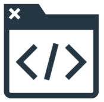
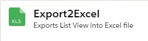

# Inner Source Community

This page is intended to provide the links to those repositories that are encouraging contribution, whether it be driven from capability leadership or individual practicitioners. We want to make sure those projects are visible above the rest. Many of the sections below are placeholders, which we hope the community will help fill in. Where possible- let's try to make code available that is already written!

# Capability Leadership Recommendations

This section provides a means for CC Leadership to convey important projects to practictioners in the community. Please leave for CC Leads to modify.

- [Shell.Translate.Web](https://github.com/sede-x/Shell.Translate.Web)
  - The Shell Web Translator is used to provide secure translation facilities for Shell. In the past, web-based public translation utilities (e.g. Google Translate) posed risks to Shell's information, so this helps to fill the gap to prevent leakage of confidential data.
  - This project is setup an example of how inner source should be done- it provides the structure and documentation to make it easy to get started, the branching and pipeline to minimize issues introduced, and it is welcoming to anyone that wants to review or contribute.

- React Client Framework (TBA)
  - The Client Framework is a React-based framework that accelerates the start-up of new mobile and web applications. It integrates Shell branding and styles to make it easy to get up and running, and stay compliant with reduced effort.
  - The Client Framework will be one of the first foundational elements of native software engineering, made available for everyone in the coming months to use, review, and contribute.

# Community Suggestions

This section is open for others to submit their works and make it visible for others to see. If you want to add a project, please update this page and add to the proper section. It should follow the format of:

- Repository name with link
  - Short summary

*Only add works if it follows the inner source practices and principles outlined in the [first page](README.md)!*

## Suggestions with >20 contributors

- \<none yet\>

## Suggestions with >10 contributors

- \<none yet\>

## Suggestions with >5 contributors

- \<none yet\>

## Additional Suggestions

- [shell-slack-app](https://github.com/sede-x/shell-slack-app)
  - The Shell Slack app is used to provide Shell-specific capabilities to our Slack Workspaces. The first app is 'Shell-Links' available in several workspaces already to provide useful links on-demand via the Slack UI.
- [shell-inner-source-analysis](https://github.com/sede-x/shell-inner-source-analysis)
  - This work was started to provide analysis facilities to see how well we're doing in inner source activities, and building the community. It can also serve as a means to show people how to work with the GitHub APIs. This is only the framework right now, but welcome for others to review/contribute.
- [ salesforce-export2excel](https://github.com/sede-x/salesforce-export2excel) 
  - Download Salesforce List View records into Excel file. This repository is based on org developement model. For SFDX version, please refer to [salesforce-export2excel-sfdx](https://github.com/sede-x/salesforce-export2excel-sfdx) 
  

# Learning Suggestions

This section contains references to repos created by community members for the purpose of learning. These repos are expected to contain working examples along with instructions to setup and execute. If you would like to add a repo, please update this page and add under respective topic. It should follow the format of:

- Repository name with link
  - Short summary

*Only add works if it follows the inner source practices and principles outlined in the [first page](README.md)!*

## Go
- [Learning Go](https://github.com/bijeshos/learning-go)
  - This repository contains programs explained during Tech Talk on `Go Fundamentals` and many more examples. Topics covered include: hello-world, variable declaration, pointers, flow control, arrays, slices, maps, functions, methods, structs, interfaces, concurrency and unit testing.

## Python

- \<none yet\>

## React

- \<none yet\>

