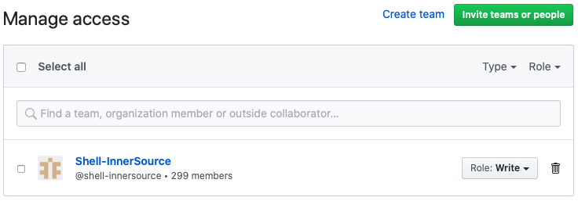

# Shell Inner Source Overview (shell-inner-source)
This project is designed to outline how code, documentation, and build should be structured for inner source at Shell. This will of course vary by technology and target platform, but the core concepts, principles, and techniques should remain the same.

If you are looking for Inner Source works, they are located in [COMMUNITY](COMMUNITY.md).

# Key Principles and Practices
These are the tenets of inner source at Shell and should be followed by all projects. If the project pre-dates the tenets, then it should put a plan in place to bring it in line.

- The *what, why, how* should be documented within the repo about the included codebase
- The codebase should be able to be cloned and built with no additional dependencies
- Contribution should be open to anyone, although quality must be controlled
- GitHub issues should be used to track enhancements and issues
- The code build and test should be fully automated, preferably with GitHub Actions
- The code/structure should follow industry practices and ensure low barrier to entry for new contributors
- **Communications and discussions should be welcoming and respectful**

The details on how to fulfill these details are listed and linked below.

*Additional note: Repo naming follows [GitHub naming conventions](https://github.com/bcgov/BC-Policy-Framework-For-GitHub/blob/master/BC-Gov-Org-HowTo/Naming-Repos.md)*

# Contribution

The key reason to make GitHub available and encourage inner source practices is to leverage contributions from engineers across the company and provide a means for people to learn from existing solutions.

The majority of repositories at Shell should be marked as 'internal' and visible to all Shell engineers. They should also allow controlled contribution from anyone, meaning that there must be a clear and easy means for people to submit changes. The rest of this page is mean to outline the practices and structure to support this objective.

**Note: In order for anyone to be able to create branches and pull requests, you must add *Shell-InnerSource* Team to repo access**



Each repository should contain a [CONTRIBUTION.md](/CONTRIBUTION.md) file that details how to contribute. This link includes contribution guidance and an example.

# Code Structure/Build

The code should be structured in the industry-standard format for your particular technology and platform, and follow industry norms. A few examples:
- No binaries or dependencies directly in the repo, using scripts and artifact reposities as needed to pull dependencies (e.g. requirements.txt for Python apps like this one)
- Your README.md should explain how to build, test, and integrate
- The repo should be integrated with GitHub Actions or Azure Pipelines for fully automated build and quality checks (e.g. .github/workflows in this repo)

# Licensing

The vast majority of Shell inner source code should not have a license in the repo, but all code & binaries should be copyrighted with All Rights Reserved. This leaves the license/distribution to the project that it is being integrated into. A example file header is below and should be included in all files.

```python
# *************************************************************************
#
# Royal Dutch Shell
# __________________
#
# Copyright (c) 2020, Royal Dutch shell. All Rights Reserved.
#
# NOTICE:  All information contained herein is, and remains
# the property of Royal Dutch Shell and its suppliers,
# if any.  The intellectual and technical concepts contained
# herein are proprietary to Royal Dutch Shell
# and its suppliers and may be covered by U.S. and Foreign Patents,
# patents in process, and are protected by trade secret or copyright law.
# Dissemination of this information or reproduction of this material
# is strictly forbidden unless prior written permission is obtained
# from Royal Dutch Shell.
# *************************************************************************
```

# Documentation

Documentation is critical to contribution and adoption of shared code. At a high level, all codebases should have 2 types of documentation:
- User documentation: This is for developers or users of the repo, whether it be API documentation for services/libraries or application documentation for use of an application.
- Contributor documentation: This is for developers that may want to build/support or potentially contribute to the repo.

## User documentation

User documentation for the services/libraries/application should be included in the codebase whenever possible to assure that code & documentation stay synced and tightly linked. This will typically take the form of markdown pages combined with generated documentation (e.g. API documentation generated from the code), stored in the same Git repository. Documentation generated from code should be part of an automated pipeline to assure it's always successful and current.

## Contributor documentation

The documentation for contributors should be present in the [README.md](/README.md) and [CONTRIBUTION.md](/CONTRIBUTION.md) files. This may include references to additional documentation and potentially external design documentation (although external links should be minimized to reduce dependencies).

### The README.md should include (but is not limited to)

1. Overview of the repository (including *why*)
2. User/usage details (and links)
3. Contribution information (including system requirements and link to CONTRIBUTION.md)
4. Getting started guidance
5. Feedback/moderation (e.g. who to contact)

### The CONTRIBUTION.md should include

1. Contribution process
2. Moderation/quality management

<tweak>
